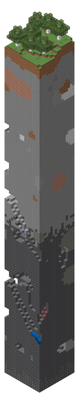
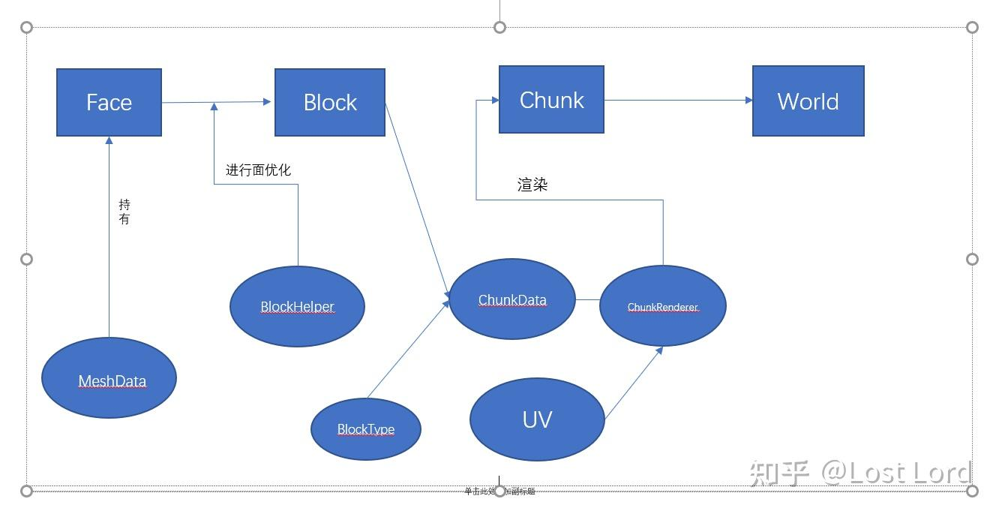
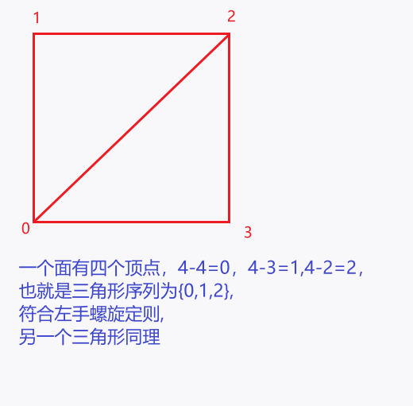
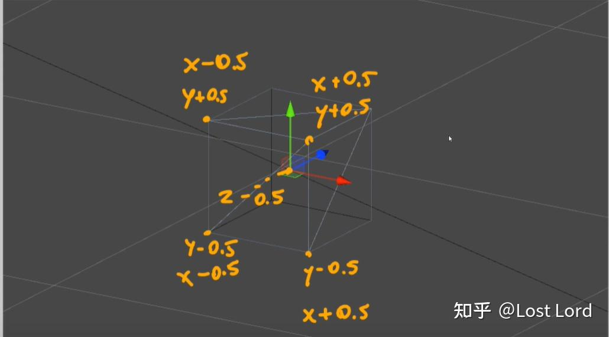
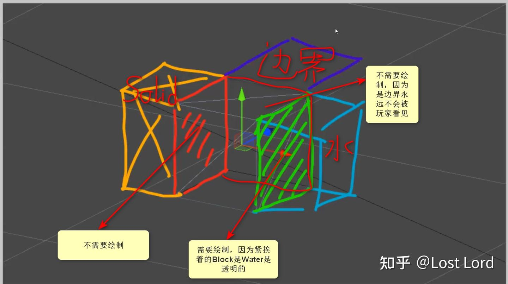
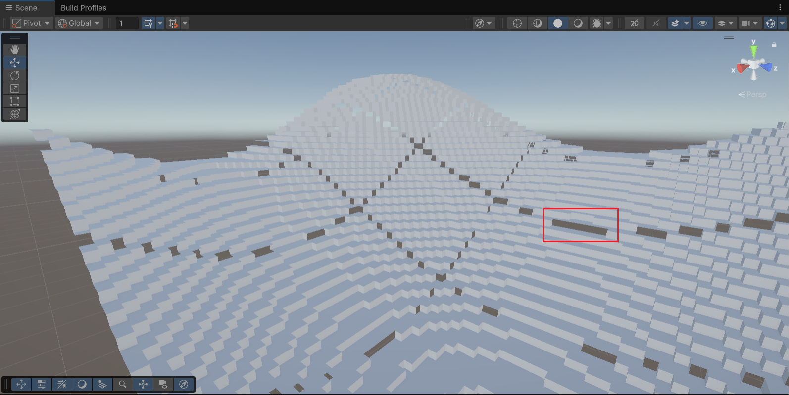

  
  <h1>MineCraftForUnity</h1>
  
unity + MineCraft 

  
用Unity实现我的世界 

## 功能清单

- [ ] 方块数据
  - [ ] 方块类型
  - [ ] 方块属性
  - [ ] 纹理索引管理
  - [ ] 方块编辑器

- [ ] 地形数据管理
  - [ ] 区块数据结构
  - [ ] 世界坐标系统
  - [ ] 数据持久化方案

- [ ] 区块系统实现
  - [ ] 区块生成
  - [ ] ~~生物群系~~
  - [ ] 区块加载/卸载
  - [ ] 网络生成优化
  - [ ] 视锥剔除
  - [ ] LOD

- [ ] 方块管理
  - [ ] 方块主次
  - [ ] 交互
  - [ ] 更新机制

- [ ] 方块放置与破坏
  - [ ] 射线检测
  - [ ] 方块选择高亮
  - [ ] 破坏进度显示

- [ ] 人物控制
  - [ ] 物品栏
  - [ ] 手持物品显示
  - [ ] 加护距离限制

- [ ] 工具使用
  - [ ] 稿子
  - [ ] 剑
  - [ ] 斧头
- [ ] 多人联机

## 地图生成-2025.10.17

### 初步试验

- https://zhuanlan.zhihu.com/p/571622819

按照文章的内容对生成的单个区块的地形生成做了实现，大致思路如下：

1. 生成噪声
2. 噪声值与高度的乘积决定上表面
3. 与最高上表面和水面高度进行判断
   1. 最高表面为`Grass_Dirt`，其余下面为`Dirt`
   2. 高于最高表面的取最大值
   3. 低于水面的上表面材质换成`sand`，高于的正常材质

> Block类型说明：
>
> ​	`Sand`:灰色、`Grass_Dirt`:绿色、`Dirt`:黄色、`Water`:蓝色

虽然模拟实现了地形区块生成的过程，但是地形过大的时候会导致游戏性能开销极大，因此方法只能作为一个最初的思路（也许还有其他方向？）

### 优化

在生成的地形中可以看到许多的被**遮挡的表面**是**没有必要被渲染**的，但是仍然需要保留方块信息的存在，因此需要维护两个方块数据表，一个存放所有`Block`信息，一个存放需要被渲染的`Block`的实体。为了进一步的性能提升还可以采用面优化技术，就是将玩家永远看不到的面剔除。

> 原作者的简单介绍：
>
> “我们知道在Unity中，一个面由2个三角面构成，这两个三角面又是4个顶点的组合按照左手螺旋的顺序来构成的。所以要想单独渲染一个面，我们就得提供顶点和三角形。所以我们实现Minecraft的地形时采用的动态Mesh生成，而不是把方块做成Prefab,然后实例化。针对不需要渲染的面，我们就不给它提供顶点或者三角面即可。（建议读者可以去了解下Unity中的Mesh）”

### 整体逻辑

首先，利用动态生成Mesh代替Prefab实例化去生成地形。然后就是将基于三种基本单位：

1. Face 面
2. Block 方块
3. Chunk 区块，同MC中的区块类似，将范围内的方块合并成一个区块，渲染时，以区块为单位渲染。

三种单位之间的具体关系可以概述为：几个Face构成一个Block，很多Block构成一个Chunk。

> MC中的Chunk是16x16x256包含许多方块的集合，由于一个世界极大并且包含极多区块，因此游戏仅加载部分区块以使游戏可玩，游戏不会运算已卸载的区块。
>
> - https://minecraft.fandom.com/zh/wiki/%E5%8C%BA%E5%9D%97
>
> 

原作者脚本设计思路：

### 过程

#### [MeshData](Assets/Scripts/WorldGenerateByCatNine/Face/MeshData.cs)

用来保存一个Face所需要的信息（顶点、三角面和UV）以及动态生成Mesh

在创建过程考虑到水这类半透明且没有碰撞的方块

顶点添加图示

#### [ChunkRenderer](Assets/Scripts/WorldGenerateByCatNine/Chunk/ChunkRenderer.cs)

> - 这里我认为方块仍然需要一个类来创建不同方块的功能与交互逻辑，在后续考虑是否需要添加...

因为是在生成Chunk时，在Chunk内部做二重循环去生成`Block`，所以没有必要单独写一个Block类，至于`BlockHelper`主要是为了进行面优化，所以需要考虑`Block`的所有邻居`Block`的状态，就需要把Chunk类先写出来才能是心啊`BlockHelper`，而`Chunk`类则需要`ChunkData`和`ChunkRnderer`两个类.

[ChunkData](Assets/Scripts/WorldGenerateByCatNine/Data.cs)

`ChunkRenderer`的主要作用就是选软Chunk，就是根据`MeshData`去生成Mesh，但是需要注意把Block分为MainBlock和WaterBlock，为了减少开销，在一个物体上生成两个SubMesh，利用一个SubMesh对应一个Mererial的性质去分别生成两种Block。

#### [Chunk](Assets/Scripts/WorldGenerateByCatNine/Chunk/Chunk.cs)

"目前还没有任何一个类去填充`MeshData`(即`MeshData`的顶点List，三角形List等还没有数据)。所以我们将会在`BlockHelper`中进行`MeshData`的填充(因为`BlockHelper`是细化到`Chunk`中每个Block的每个面)，而今天要写的Chunk脚本更像是一个辅助类去提供一些便利的方法供BlockHelper调用以便更好在Chunk内遍历时填充数据。"

1. `LoopThroughTheBlocks` - 区块遍历
2. `GetPostitionFromIndex` - 索引到坐标转换
3. `GetIndexFromPosition` - 坐标到索引转换
4. 边界检查方法
   1. `InRange`：检查X和Z轴是否在区块范围内
   2. `InRangeHeight`：检查Y轴是否在高度范围内
5. `GetBlockFromChunkCoordinates` - 获取方块类型
6. `SetBlock` - 设置方块类型
7. `GetChunkMeshData` - 生成网格数据
8. `ChunkPositionFromBlockCoords` - 世界坐标到区块坐标

#### Face与贴图

“我们在生成了Face的顶点和三角形数据后，还需要给其每个面贴上贴图。贴贴图实际上就是利用纹理映射将图片和Mesh上的点一一对应。由于每个不同类型的Block的贴图都不一样，我们首先要把BlockType和图片进行对应，为了实现上述功能，我们声明一个继承于ScriptableObject的BlockData类来保存图片上的UV信息。然后在BlockManager类去统一管理UV信息。”

#### [BlockHelper](Assets/Scripts/WorldGenerateByCatNine/Block/BlockHelper.cs)

“前面的多篇文章都提到了BlockHelper这个类，之所以它会出现在很多地方，因为它是这个项目的核心之一，前面编写的很多脚本都是为它做铺垫的。在思维导图中我们看到BlockHelper是对Chunk进行面优化的。那么它是如何实现面优化的呢？我们结合着代码来解释。”

#### [World](Assets/Scripts/WorldGenerateByCatNine/World/World.cs)

顾名思义，它就是负责将我们的地形在Unity中生成出来。

### 最后

作者的方法可以有效的提供一种地形优化渲染的方案，但是该方法生成后Chunk之间的方块存在渲染问题，需要对边界做处理，同时如何获取方块和方块交互还需要思考，需要验证方法是否可行。但是对表面剔除和合并Chunk渲染的方式值得学习。总体来说效果不错

> 目前只是简单的使用柏林噪声生成地形，世界上的生成有叠加更多的噪声层，如温度，湿度等信息根据不同的权重生成不同风格的地形。但是目前是试验阶段，先实现简单的功能为妙。

## 参考资料

- https://developer.unity.cn/projects/5f35326fedbc2a002071984d
  - https://github.com/Jin-Yuhan/MinecraftClone-Unity
- https://zhuanlan.zhihu.com/p/571622819

- 【【Unity教程搬运】如何在Unity中创建Minecraft：终极指南 (2024)】 https://www.bilibili.com/video/BV1cJ4m137oj/?share_source=copy_web&vd_source=03b89d7c0f287bbb21e7897d1e86a944
