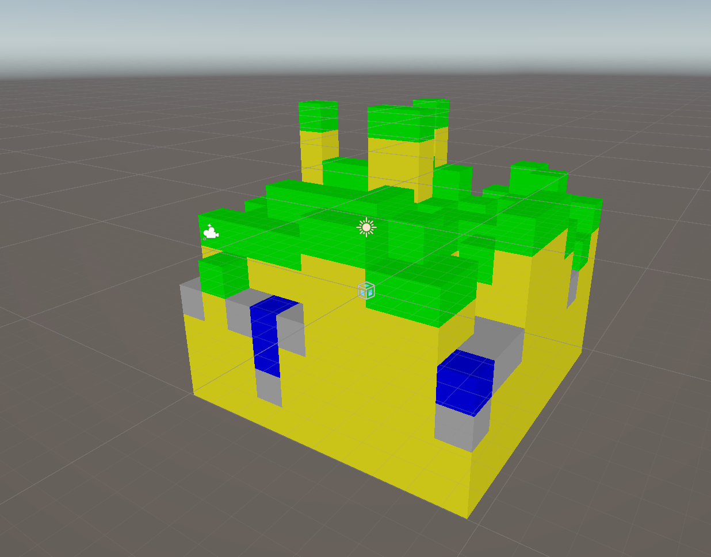

  
  <h1>MineCraftForUnity</h1>
  <blockquote>unity + MineCraft </blockquote>
  <blockquote>用Unity实现我的世界 </blockquote>

## 地图生成

- https://zhuanlan.zhihu.com/p/571622819

按照文章的内容对生成的单个区块的地形生成做了实现，大致思路如下：

1. 生成噪声
2. 噪声值与高度的乘积决定上表面
3. 与最高上表面和水面高度进行判断
   1. 最高表面为`Grass_Dirt`，其余下面为`Dirt`
   2. 高于最高表面的取最大值
   3. 低于水面的上表面材质换成`sand`，高于的正常材质

> `Sand`:灰色、`Grass_Dirt`:绿色、`Dirt`:黄色、`Water`:蓝色

虽然模拟实现了地形区块生成的过程，但是地形过大的时候会导致游戏性能开销极大，因此方法只能作为一个最初的思路（也许还有其他方向？）

## 方块编辑器

## 功能清单

- [ ] 地形生成
- [ ] 方块编辑
- [ ] 人物控制
- [ ] 工具使用
  - [ ] 稿子
  - [ ] 剑
  - [ ] 斧头
- [ ] 多人联机

## 参考资料

- https://developer.unity.cn/projects/5f35326fedbc2a002071984d
  - https://github.com/Jin-Yuhan/MinecraftClone-Unity
- https://zhuanlan.zhihu.com/p/571622819

- 【【Unity教程搬运】如何在Unity中创建Minecraft：终极指南 (2024)】 https://www.bilibili.com/video/BV1cJ4m137oj/?share_source=copy_web&vd_source=03b89d7c0f287bbb21e7897d1e86a944
